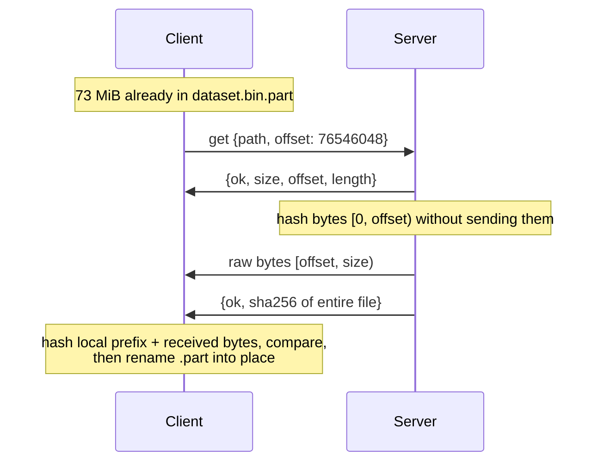
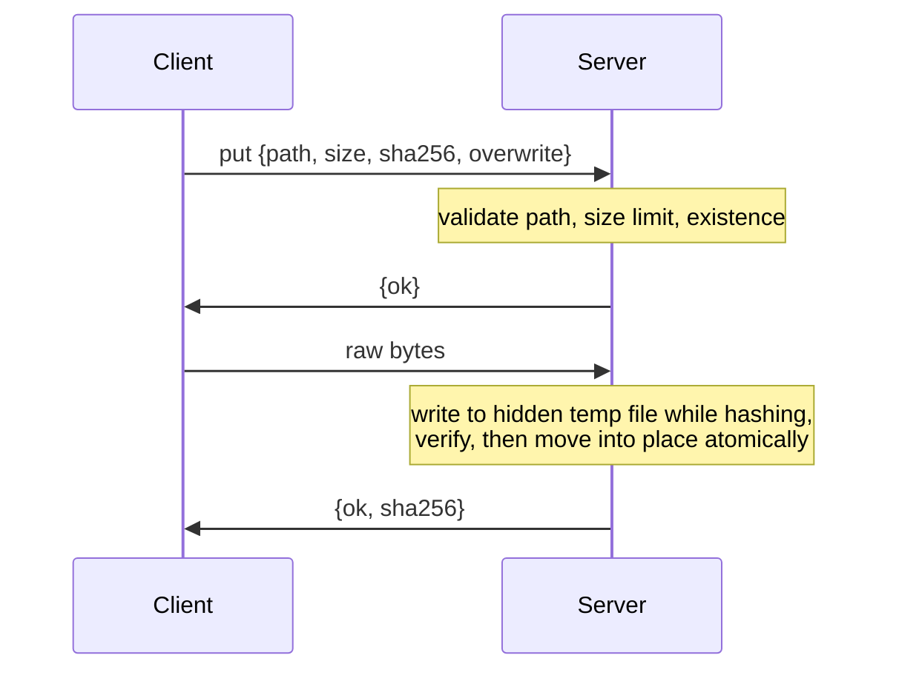

# asynco-file-transfer

Concurrent, integrity-checked file transfer over TCP in Python: an `asyncio` server and client with resumable downloads, atomic uploads, end-to-end SHA-256 verification, and a path sandbox.

The server handles many clients on a single event loop. Disk I/O and hashing run in worker threads, so one slow client never stalls the others. Every transfer is verified end to end, interrupted downloads resume where they stopped, uploads become visible only once complete and verified, and requests cannot reach files outside the served directory.

---

## Highlights

- **Throughput:** about 320 to 360 MiB/s over loopback with full SHA-256 verification, sustained with 16 concurrent clients on a single CPU core.
- **Resumable downloads:** an interrupted transfer continues from the last byte received, and the checksum covers the *whole* file, including the part downloaded before the interruption.
- **Atomic uploads:** uploads are written to a hidden temporary file, verified, and then renamed into place, so readers never see a partial or corrupt file. When two clients race to create the same new file, exactly one wins.
- **Path sandbox:** directory traversal, absolute paths, and symlinks that point outside the served directory are all rejected.
- **Resource limits:** caps on connections, request size, upload size, and idle time bound what any one client can consume.
- **No dependencies:** only the Python standard library, with 38 tests.

---

## Quick Start

Requires Python 3.10 or later.

```bash
pip install .
```

This installs the `filetransfer` command. Serve a directory:

```bash
filetransfer serve --root ./shared --port 9000
```

From another terminal or machine:

```text
$ filetransfer ls --host 127.0.0.1 --port 9000
   381.5 MiB  2026-09-24 06:04  dataset.bin

$ filetransfer get dataset.bin
^C                                         # interrupted after 73 MiB

$ filetransfer get dataset.bin
dataset.bin: 381.5 MiB verified (sha256 de63f08cfca2d6ad...), 266.0 MiB/s, resumed at 73.0 MiB

$ filetransfer put dataset.bin backups/copy.bin
backups/copy.bin: 381.5 MiB stored and verified (sha256 de63f08cfca2d6ad...), 305.0 MiB/s

$ filetransfer get ../../etc/passwd
error: server refused: path escapes the served directory (forbidden)
```

A progress bar with live throughput is shown when running in a terminal.

---

## Protocol

TCP delivers a stream of bytes with no message boundaries, so the protocol defines them explicitly. Control messages are **frames**: a 4-byte big-endian length followed by that many bytes of UTF-8 JSON. File contents are not framed; they follow a frame that announces their exact length, so the receiver always knows where the data ends. Every request carries a protocol version (`"v": 1`).

| Operation | Request fields | Response |
|---|---|---|
| `list` | `path` | Directory entries: name, type, size, and modification time |
| `stat` | `path` | Type, size, and modification time |
| `get` | `path`, `offset` | Header with `size`, `offset`, `length`; then `length` raw bytes; then a trailer with the SHA-256 of the entire file |
| `put` | `path`, `size`, `sha256`, `overwrite` | Ready; the client sends `size` raw bytes; then confirmation with the stored file's SHA-256 |

Failures are `{"ok": false, "error": <code>, "message": <text>}`, with codes such as `not_found`, `forbidden`, `exists`, `too_large`, `checksum_mismatch`, and `busy`. A rejected request leaves the connection open for the next one; a connection is closed only when its byte stream can no longer be trusted, for example after a malformed frame or a truncated upload.

### Download with resume



### Upload



---

## Design

### Concurrency

One `asyncio` event loop accepts connections and moves bytes between sockets, while file reads, writes, and SHA-256 updates run in worker threads through `asyncio.to_thread`. The event loop therefore never waits on the disk, and CPython's `hashlib` releases the global interpreter lock while hashing large buffers, so checksums for different transfers can be computed on several cores at once.

Data moves in 1 MiB chunks. After each chunk, the sender waits on `StreamWriter.drain()`, which applies **backpressure**: a slow receiver slows its own sender instead of making the server buffer unbounded amounts of data in memory.

Each connection can issue any number of requests in sequence, so clients avoid a TCP handshake per file.

### Integrity

- **Downloads:** the server's trailer carries the SHA-256 of the entire file. On resume, it hashes the prefix the client already has without sending it, and the client hashes its local partial file, so the final comparison covers every byte. If a resumed download fails verification, for example because the partial file was corrupted or the remote file changed, the client discards it and restarts once from the beginning.
- **Uploads:** the client sends the SHA-256 up front. The server hashes the data as it arrives and stores the file only if the two match.
- Downloads are written to `<name>.part` and renamed only after verification, so an interrupted download never leaves a file that looks complete.

### Atomic uploads

Uploads are received into a hidden `.upload-<id>.part` file in the destination directory. After verification, the file is moved into place:

- with `overwrite`, by an atomic rename;
- without `overwrite`, by creating a hard link, which fails atomically if the name already exists. This guarantees that concurrent uploads to the same new name produce exactly one winner, without a check-then-write race. On file systems without hard links, it falls back to a check followed by a rename.

Temporary files are removed on every failure path, including checksum mismatches and dropped connections, and are hidden from listings and unreachable through the API.

### Path sandbox

Every client path is resolved, including `..` components and symbolic links, and must still lie inside the served root. Absolute paths, Windows drive paths, NUL bytes, non-string paths, and in-progress upload files are rejected.

### Resource limits

| Limit | Default | Purpose |
|---|---|---|
| Concurrent connections | 256 | Further clients receive a `busy` error |
| Request frame size | 64 KiB | Bounds memory spent parsing any request |
| Upload size | 64 GiB | Rejected before any data is sent |
| Idle timeout | 300 s | Closes connections with no new request |
| Transfer timeout | 60 s per 1 MiB chunk | Stops stalled uploads from holding resources |
| Read-only mode | Off | Rejects all uploads |

---

## Command Reference

```text
filetransfer serve --root DIR [--host 127.0.0.1] [--port 9000] [--max-connections 256]
                   [--read-only] [--max-upload-mb 65536] [--idle-timeout 300] [-v]
filetransfer ls    [PATH] [--host H] [--port P] [--timeout S]
filetransfer get   REMOTE [LOCAL] [--no-resume] [--host H] [--port P] [--timeout S]
filetransfer put   LOCAL REMOTE [--overwrite] [--host H] [--port P] [--timeout S]
filetransfer bench [--clients 1,4,16] [--size-mb 32] [--repeat 3]
```

`python -m filetransfer` works as well. The exit status is 0 on success, 1 on errors (including refused requests and failed verification), and 2 on invalid usage.

### Python API

```python
import asyncio
from pathlib import Path
from filetransfer import FileTransferClient

async def main():
    async with FileTransferClient("127.0.0.1", 9000) as client:
        print(await client.list(""))
        result = await client.get("dataset.bin", Path("dataset.bin"))
        print(result.sha256, result.throughput)
        await client.put(Path("notes.txt"), "docs/notes.txt", overwrite=True)

asyncio.run(main())
```

---

## Benchmark

`filetransfer bench` starts a server and runs concurrent clients against it over loopback. Every transfer is fully SHA-256 verified, and downloads are written to disk.

### Setup

| Parameter | Value |
|---|---|
| Transfer | 32 MiB of random data per client, per operation |
| Clients | 1, 4, and 16 concurrently |
| Hardware | Linux container with 1 available CPU |
| Python | 3.12 |
| Method | Median of 3 runs per configuration |

### Results

| Operation | Clients | Time | Aggregate throughput | Per client |
|---|---:|---:|---:|---:|
| Download | 1 | 0.089 s | 357.6 MiB/s | 357.6 MiB/s |
| Upload | 1 | 0.101 s | 318.3 MiB/s | 318.3 MiB/s |
| Download | 4 | 0.352 s | 363.3 MiB/s | 90.8 MiB/s |
| Upload | 4 | 0.398 s | 321.6 MiB/s | 80.4 MiB/s |
| Download | 16 | 1.612 s | 317.5 MiB/s | 19.8 MiB/s |
| Upload | 16 | 1.782 s | 287.4 MiB/s | 18.0 MiB/s |

### Analysis

**Throughput holds under load.** Going from 1 to 16 concurrent clients, aggregate throughput drops by only 11% for downloads and 10% for uploads. Bandwidth is shared evenly: each of 16 clients receives about one sixteenth of the total.

**The limit is the CPU.** With one core, the server, all clients, and every SHA-256 computation share the same processor, so these figures are a floor. Verifying each transfer costs roughly one full pass of hashing over the data on each side. On multi-core hardware, the worker threads can hash concurrent transfers in parallel, since `hashlib` releases the interpreter lock; that scaling was not measured here. Run `filetransfer bench` on your own machine to measure it.

**Loopback measures the software, not the network.** On a real network, link bandwidth usually becomes the limit well before these rates.

---

## Project Structure

```text
.
├── pyproject.toml
├── src/filetransfer
│   ├── protocol.py      # Frame encoding, limits, response helpers
│   ├── server.py        # FileServer: connections, operations, limits, statistics
│   ├── client.py        # FileTransferClient: list, stat, get with resume, put
│   ├── streaming.py     # Chunked, hashed, backpressured file/socket transfer
│   ├── sandbox.py       # Confines paths to the served root
│   ├── errors.py        # Error codes and exception types
│   ├── progress.py      # Terminal progress bar
│   ├── bench.py         # Concurrent loopback benchmark
│   ├── cli.py           # Command-line interface
│   └── __main__.py
└── tests                # 38 tests (unittest; also runnable with pytest)
```

---

## Testing

```bash
python -m unittest discover -s tests -t .
```

| Area | Coverage |
|---|---|
| Protocol | Round trips including Unicode paths, consecutive frames, clean EOF, truncated, oversized, empty, and non-JSON frames, timeouts |
| Sandbox | Traversal, absolute and Windows paths, NUL bytes, escaping and internal symlinks, hidden upload files |
| Downloads | Sizes from 0 bytes to 3 MiB, resume from a partial file, restart on a corrupt or oversized partial file, no-resume mode, many requests on one connection |
| Uploads | Verification, explicit overwrite, wrong checksum, interrupted uploads leaving no files behind, invalid targets |
| Concurrency | 40 simultaneous downloads of one file; 10 simultaneous uploads racing for one name, with exactly one winner |
| Limits | Read-only mode, upload size limit, connection limit, idle timeout, malformed traffic isolated to its own connection, invalid requests, statistics |
| CLI | Upload, list, and download round trip against a live server, error reporting, usage errors, benchmark |

---

## Security Notes

The server has **no authentication and no encryption**. Anyone who can reach its port can list and download every file under the served root and, unless `--read-only` is set, upload files. By default, it binds only to `127.0.0.1`. To use it across machines, run it on a trusted network or reach it through an SSH tunnel or VPN, and prefer `--read-only` when uploads are not needed.

Upload resumption, directory transfers, and authentication are not implemented.

---

## Project History

This repository began as a basic socket programming exercise that sent a single file per connection. It was rewritten to fix defects in that version, including truncation of any file larger than 1 KiB, a directory traversal vulnerability, a server crash on empty requests, files silently not being saved, and no support for concurrent clients, and to add resumable, verified, concurrent transfers.

---

## License

MIT. See [LICENSE](LICENSE).
